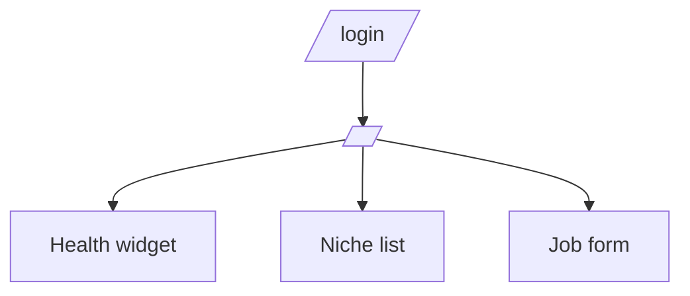
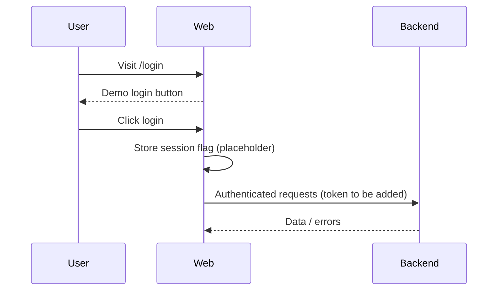

# Frontend Plan

## Goals & Users
- **Creator/Operator:** Submit prompts/stories, monitor job health, download outputs.
- **QA/Reviewer:** Verify content safety, retry or cancel jobs.
- **Observer/Stakeholder:** View system health and niche catalog without mutating state.

## IA & Routes
- `/login` → Placeholder auth entry (guarded, no data) – public.
- `/` → Dashboard with health summary, niche list, and job creation form – requires auth.

Mermaid sitemap:

Auth flow:

## Framework Decision
- **Choice:** SPA via **Vite + React + TypeScript** in `/web`.
- **Rationale:** Low SEO needs (authenticated console), fastest DX, small bundle, easy integration with React Query and Playwright. SSR not required until public marketing pages exist.

## API Contract Mapping
- Existing endpoints: `GET /health`, `GET /niches`, `POST /jobs`, `GET /jobs/:id`.
- Proposed OpenAPI additions (future):
  - `GET /jobs` list with pagination/filters.
  - `POST /jobs/:id/cancel`.
  - Auth: `Authorization: Bearer <token>` on all non-health routes.
- Frontend client in `src/api/client.ts` models health, niches, and job creation with typed responses.

## State & Data
- React Query for caching + retries; stale time 30s on reads.
- Mutations: job creation invalidates `jobs` cache (future list view). Optimistic status message shown.
- Loading/error/empty states implemented in `HomePage` with skeleton text and alerts.

## Design System
- Tokens in `src/styles/tokens.css` (color, spacing, radius, shadow, typography).
- Base components: `Button`, `TextField`, `Card` with focus styles and disabled states.
- Grid layout for dashboard; responsive via CSS grid.
- Accessibility: semantic headings, labelled inputs/selects, `aria-busy`, `role="alert/status"` on feedback.

## AuthN/AuthZ
- Placeholder `useAuth` hook uses localStorage. Swap for secure session (httpOnly cookie + CSRF token) or short-lived JWT in memory. Route guard redirects unauthenticated users to `/login`.
- CORS to be restricted server-side; prefer SameSite/Lax cookies for web console domain.

## A11y & i18n
- Target WCAG 2.1 AA; keyboard-focusable controls, visible outlines, semantic landmarks.
- Copy centralized via React components; future i18n can wrap strings or use ICU messages.

## Perf Budgets & CWV
- Goals: LCP <2.5s, INP <200ms, CLS <0.1 on desktop-class devices.
- Bundle budget: <200KB gzipped initial JS; code-split routes as app grows.
- Cache: HTTP cache for static assets; prefetch niches/health post-login.

## Security
- Draft CSP: `default-src 'self'; img-src 'self' data:; script-src 'self'; style-src 'self' 'unsafe-inline'; connect-src 'self' http://localhost:3000` (tighten when deployed).
- Escape all text in UI; no dangerous HTML rendering. Store tokens in httpOnly cookies; avoid localStorage for real auth.
- Third-party scripts disallowed by default; review via allowlist.

## Analytics & Telemetry
- Event naming: `job.submitted`, `job.failed`, `health.viewed`, `niche.viewed` with minimal metadata, no prompts/PII. Send via first-party endpoint or server-side analytics with consent.

## Rollout Plan
- **MVP (this scaffold):** Auth placeholder, health/niche fetch, job form, mocked e2e.
- **Milestone 2:** Real auth, job list/history page, download links, retry/cancel actions, CI pipeline.
- **Milestone 3:** Role-based access, audit log, observability dashboards, A/B tests for prompts.
- Risks: backend uptime and ffmpeg availability; mitigate via preflight checks, retries, and surfacing status in UI.
